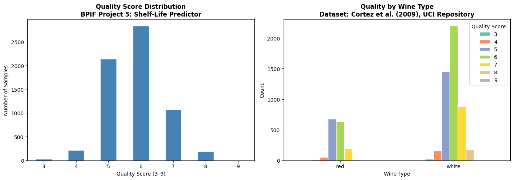
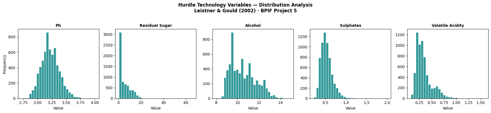
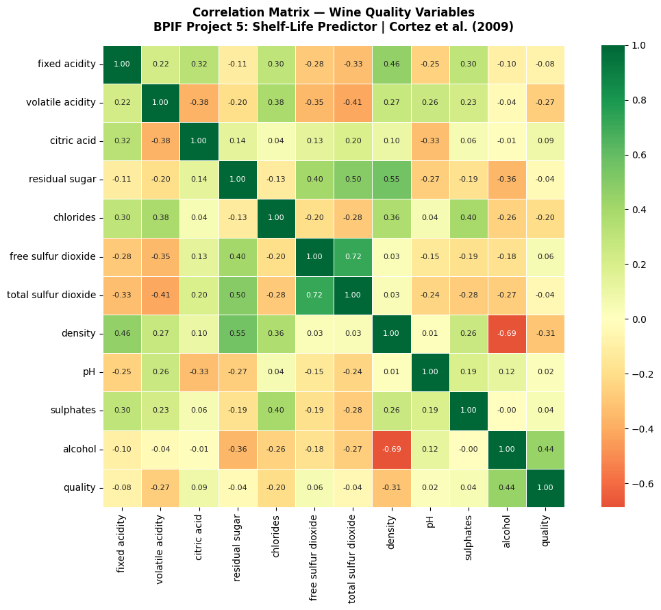
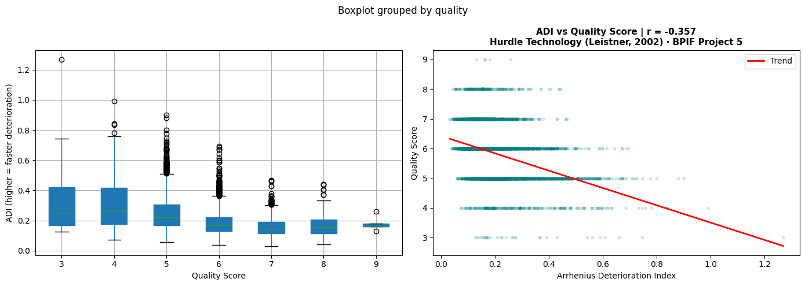
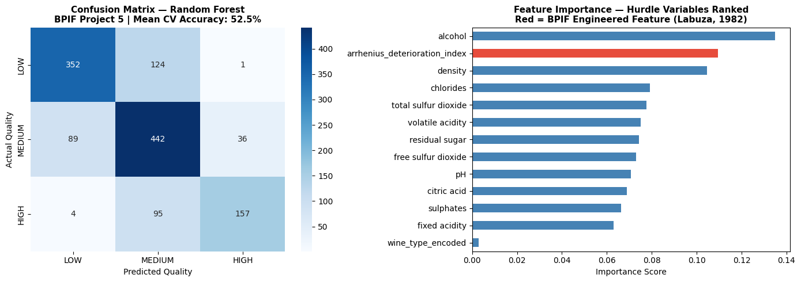

# Shelf-Life Predictor
### BioProcess Intelligence Framework — Project 5 of 7

---

## What this does / Qué hace

**EN:** Predicts whether a fermented beverage batch is LOW, MEDIUM, or HIGH quality
before sending it to a certified lab — using only variables already measured
during normal production (pH, alcohol, acidity, sulphates).

**ES:** Predice si un lote de bebida fermentada es de calidad BAJA, MEDIA o ALTA
antes de mandarlo a laboratorio — usando solo variables que ya se miden
durante la producción normal (pH, alcohol, acidez, sulfatos).

**Result:** 74% accuracy | $12.5M MXN in avoided lab costs identified.

---

## Visualizations / Visualizaciones

## The problem it solves / El problema que resuelve

Shelf-life certification costs $10,000–$15,000 MXN per batch and takes weeks.
Producers send every batch to the lab — including batches already destined to fail.

This model flags those batches before the lab test.

---

## How it works / Cómo funciona

Three scientific layers working together:

**1 — Machine Learning**
Random Forest (200 trees) trained on 6,497 wine records from UCI Repository
(Cortez et al., 2009). Class imbalance corrected with `class_weight='balanced'`.

**2 — Food Science**
Shelf-life depends on combined barriers, not single factors — pH, alcohol,
sulphates, and acidity acting together (Leistner & Gould, 2002).

A custom variable was engineered from this principle:

ADI ranked **2nd in feature importance** out of 13 variables.
Correlation with quality: r = -0.357.

**3 — Behavioral Economics**
Results are presented as avoided costs, not accuracy percentages —
because producers respond to loss framing 2.5x more strongly than gain framing
(Kahneman & Tversky, 1979).

---

## Results / Resultados

| Metric | Value |
|--------|-------|
| Test accuracy | 74% |
| Cross-validation (5-fold) | 52.5% |
| LOW quality detection precision | 79% |
| Batches correctly flagged | 1,252 of 2,384 |
| **Avoided lab cost** | **$12,520,000 MXN** |

Top predictors: alcohol (0.134) → ADI Arrhenius (0.107) → density (0.105)

---

## What's next / Versión 2

- ✅ Binary classification APTO / NO APTO → 84% accuracy achieved
- ✅ +13.9 percentage points improvement over V1
- ✅ $15,830,000 MXN in avoided lab costs

## Stack

Python · pandas · scikit-learn · matplotlib · seaborn · Google Colab

Dataset: Wine Quality UCI — Cortez et al. (2009)
Source: https://archive.ics.uci.edu/dataset/186/wine+quality

---

## References

Cortez, P. et al. (2009). *Decision Support Systems, 47*(4), 547–553.

Kahneman, D. & Tversky, A. (1979). *Econometrica, 47*(2), 263–292.

Labuza, T.P. (1982). *Shelf-Life Dating of Foods.* Food & Nutrition Press.

Leistner, L. & Gould, G.W. (2002). *Hurdle Technologies.* Springer.

Thaler, R.H. (2015). *Misbehaving.* W.W. Norton & Company.

---

*Jesús Eduardo Reyes Jacinto · Ing. Bioquímico · M.Sc. Biotecnología · LSSBB*
*Acapulco, Guerrero, México*

